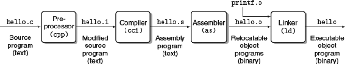

translation of source file to object file is done by compiler driver:

- Preprocessing: modifies the original C program according to directives that begin with the `#' character. For example, the #include <stdio.h> command

- Compilation: translates to assembly. function main:

    1   main:   
    2     subq      $8, %rsp
    3     movl      $.LCO, %edi
    4     call      puts
    5     movl      $0, %eax
    6     addq      $8, %rsp
    7     ret   

- Assembly: translates into machine-language instructions, packages them in a form known as a *relocatable object program*, and stores the result in the object file

- Linking: merges objects in executable
