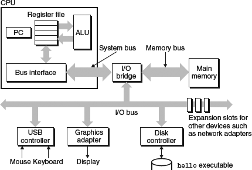
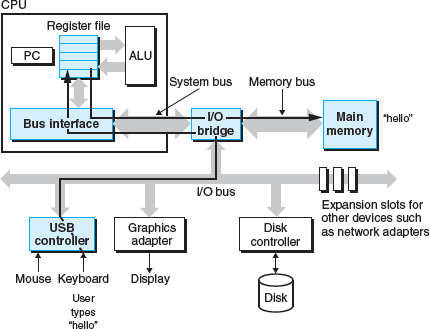

CPU: central processing unit, ALU: arithmetic/logic unit, PC: program counter, USB: Universal Serial Bus.

-Buses: The system uses buses to transfer fixed-size chunks of bytes between components, and the word size (number of bytes) varies across systems
-I/O Devices: include networks
-Main memory: temporary storage device holding program and its data, consists of DRAM chips and logically linear array of bytes with unique address (array index) starting at zero
-CPU: executes instructions in main memory, contains program counter pointing at machine instruction in main memory at any given time. 

