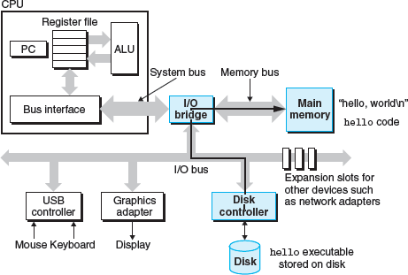
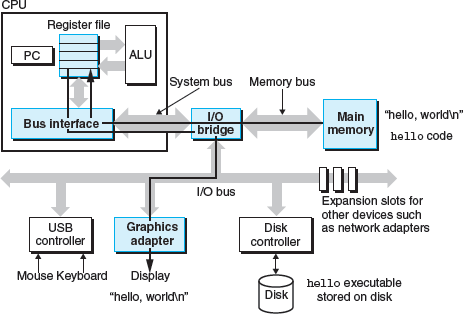
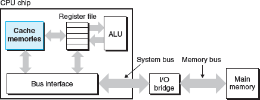
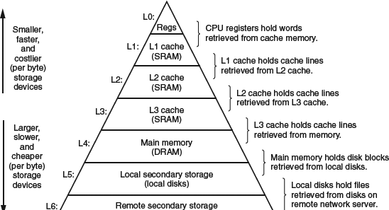

Loading the executable from disk into main memory

Writing the output string from memory to the display

Cache memories

To deal with the processor-memory gap, system designers include smaller, faster storage devices called cache memories (or simply caches) that serve as temporary staging areas for information that the processor is likely to need in the near future

application programmers who are aware of cache memories can exploit them to improve the performance of their programs by an order of magnitude
