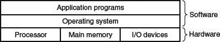
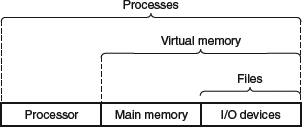
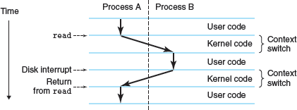
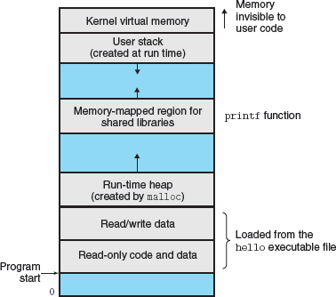

Layered view of a computer system

Abstractions provided by an operating system

process is the operating system's abstraction for a running program. Multiple processes can run concurrently on the same system, and each process appears to have exclusive use of the hardware. By concurrently, we mean that the instructions of one process are interleaved with the instructions of another process. In most systems, there are more processes to run than there are CPUs to run them

The operating system manages the context, including the current state of the PC, register file, and memory, for a process to run, and performs a context switch to transfer control between processes in a uniprocessor system by saving and restoring the context of the processes.

In a scenario with two processes, the shell process invokes a system call to create and run a new hello process, the operating system saves their respective contexts and restores the shell's context after hello terminates. Transition is run by the kernel.

Virtual memory is an abstraction that provides each process with the illusion that it has exclusive use of the main memory. Each process has the same uniform view of memory, which is known as its virtual address space, linux virtual address space:

- Code and data sections initialized from executable object file.
- Heap expands and contracts dynamically at run time.
- Shared libraries hold code and data for libraries such as C standard and math library.
- User stack is used to implement function calls and grows when calling a function and contracts when returning.
- Top region of the address space is reserved for the kernel, and application programs cannot access it directly.

A file is a sequence of bytes
