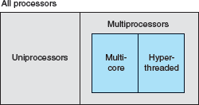
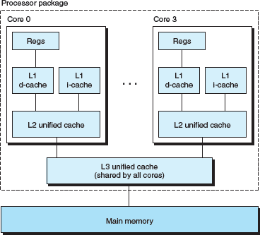
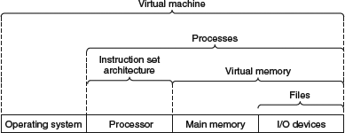

Categorizing different processor configurations

Multi-core processor organization

modern processors can execute multiple instructions at one time, a property known as instruction-level parallelism

At the lowest level, many modern processors have special hardware that allows a single instruction to cause multiple operations to be performed in parallel, a mode known as single-instruction, multiple-data(SIMD) parallelism

Some abstractions provided by a computer system

