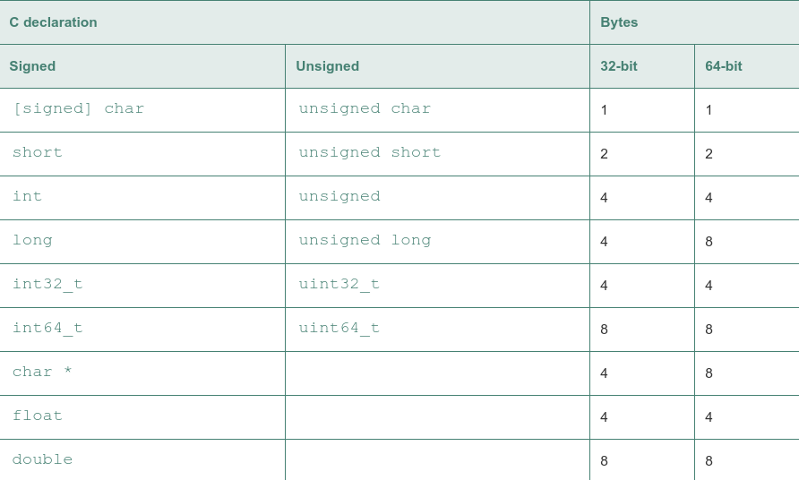
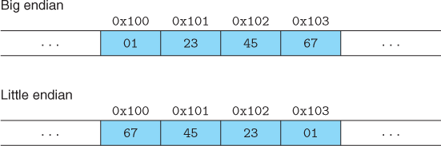

the value of a pointer in C, whether it points to an integer, a structure, or some other program object—is the virtual address of the first byte of some block of storage

Specifying different versions of C to GCC:

     version    gcc command-line option
     GNU 89 none, -std=gnu89
     ANSI, ISO C90  -ansi, -std=c89
     ISO C99    -std=c99
     ISO C11    -std=c11

hex conversion:

    Hex digit   0   1   2   3   4   5   6   7
    Decimal value   0   1   2   3   4   5   6   7
    Binary value    0000    0001    0010    0011    0100    0101    0110    0111
    Hex digit   8   9   A   B   C   D   E   F
    Decimal value   8   9   10  11  12  13  14  15
    Binary value    1000    1001    1010    1011    1100    1101    1110    1111

Typical sizes (in bytes) of basic C data types:

endians:

Code to print byte representation of program objects:

    1 #include <stdio.h>
    2
    3 typedef unsigned char *byte_pointer;
    4
    5 void show_bytes(byte_pointer start, size_t len) {
    6     int i;
    7     for (i = 0; i < len; i++)
    8          printf(“ %.2x”, start[i]);
    9     printf(“\n”);
    10 }
    11
    12 void show_int(int x) {
    13  show_bytes((byte_pointer) &;x, sizeof(int));
    14 }
    15
    16 void show_float(float x) {
    17  show_bytes((byte_pointer) &, sizeof(float));
    18 }
    19
    20 void show_pointer(void *x) {
    21  show_bytes((byte_pointer) &, sizeof(void *));
    22 }

One common use of bit-level operations is to implement masking operations, where a mask is a bit pattern that indicates a selected set of bits within a word. As an example, the mask 0xFF (having ones for the least significant 8 bits) indicates the low-order byte of a word. The bit-level operation x & 0xFF yields a value consisting of the least significant byte of x, but with all other bytes set to 0. For example, with x = 0x89ABCDEF, the expression would yield 0x000000EF. The expression ~0 will yield a mask of all ones, regardless of the size of the data representation. The same mask can be written 0xFFFFFFFF when data type int is 32 bits, but it would not be as portable.
