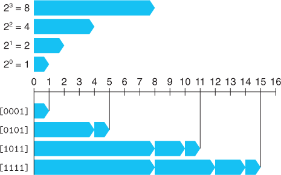
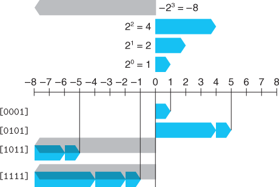
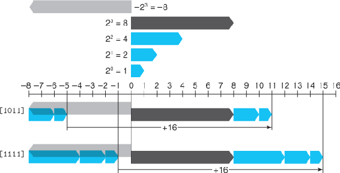
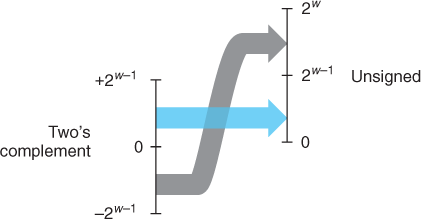
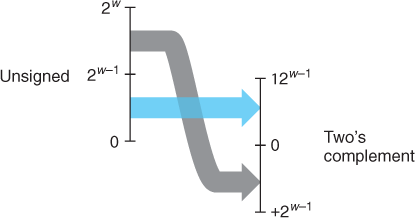
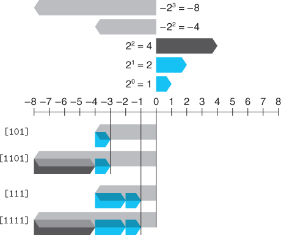

Integer data and arithmetic:

    Symbol  Type        Meaning 
    B2Tw    Function    Binary to two's complement  
    B2Uw    Function    Binary to unsigned      
    U2Bw    Function    Unsigned to binary      
    U2Tw    Function    Unsigned to two's complement
    T2Bw    Function    Two's complement to binary 
    T2Uw    Function    Two's complement to unsigned
    TMinw   Constant    Minimum two's-complement value  
    TMaxw   Constant    Maximum two's-complement value 
    UMaxw   Constant    Maximum unsigned value  
    +wt     Operation    Two's-complement addition  
    +wu     Operation    Unsigned addition   
    *wt     Operation    Two's-complement multiplication 
    *wu     Operation    Unsigned multiplication 
    -wt     Operation    Two's-complement negation  
    -wu     Operation    Unsigned negation   

B2Uw is a bijection: The function B2Uw maps each bit vector of length w to a unique number between 0 and 2^w – 1, and it has an inverse, which we call U2Bw (for “unsigned to binary”), that maps each number in the range 0 to 2^w – 1 to a unique pattern of w bits

Two's-complement: Also a bijection: for a number x, such that TMinw≤x≤TMaxw, T2Bw(x) is the (unique) w-bit pattern that encodes x

Conversion from two's complement to unsigned: B2Uw(T2Bw(x))=T2Uw(x)=x+xw−12w

Comparing unsigned and two's-complement representations

Conversion from two's complement to unsigned visually, when mapping a signed number to its unsigned counterpart, negative numbers are converted to large positive numbers, while nonnegative numbers remain unchanged:

Unsigned to two's-complement conversion: U2Tw(u)=−uw−12w+u

To convert an unsigned number to a larger data type, we can simply add leading zeros to the representation; this operation is known as zero extension

For converting a two's-complement number to a larger data type, the rule is to perform a sign extension, adding copies of the most significant bit to the representation

Sign extension:

Unsigned values are very useful when we want to think of words as just collections of bits with no numeric interpretation. This occurs, for example, when packing a word with flags describing various Boolean conditions. Addresses are naturally unsigned, so systems programmers find unsigned types to be helpful. Unsigned values are also useful when implementing mathematical packages for modular arithmetic and for multiprecision arithmetic, in which numbers are represented by arrays of words.

