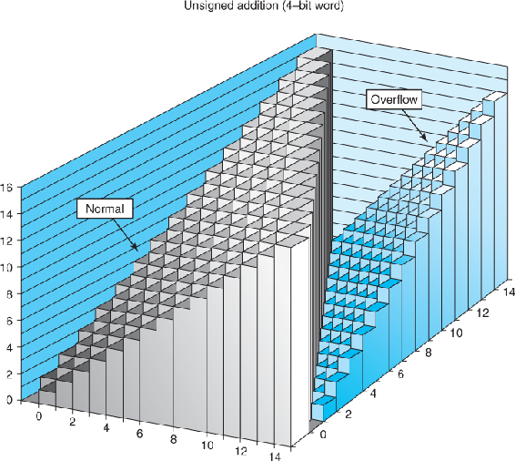
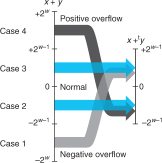
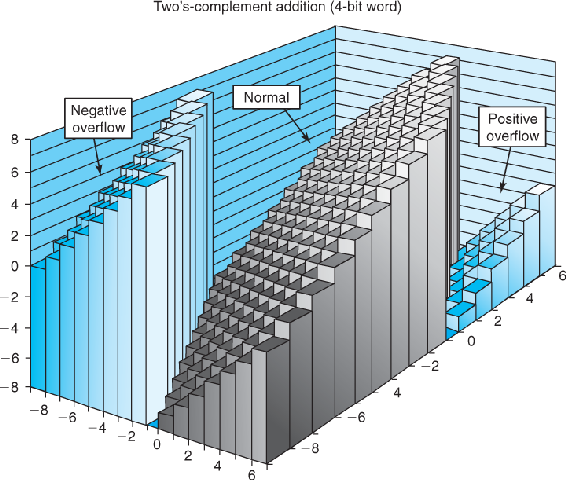
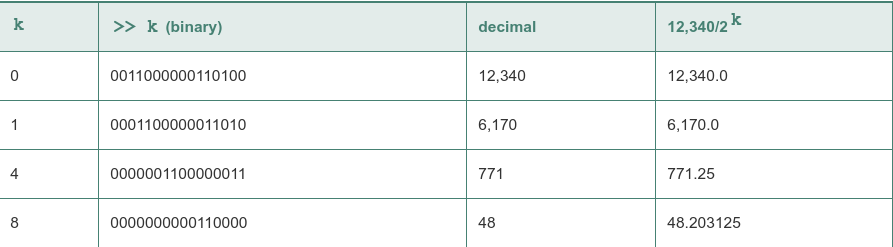

Relation between integer addition and unsigned addition: When x +y is greater than 2w – 1, the sum overflows

With a 4-bit word size, addition is performed modulo 16:

Since two's-complement addition has the exact same bit-level representation as unsigned addition, we can characterize the operation +wt as one of converting its arguments to unsigned, performing unsigned addition, and then converting back to two's complement:

When x + y is less than –2^(w–1), there is a negative overflow. When it is greater than or equal to 2^(w–1), there is a positive overflow

With a 4-bit word size, addition can have a negative overflow when x + y < –8 and a positive overflow when x + y ≥ 8

Truncating an unsigned number to w bits is equivalent to computing its value modulo 2^w

For x and y such that TMinw ≤ x, y ≤ TMaxw:

x∗wty=U2Tw((x⋅y) mod 2w)

Let x be the unsigned integer represented by bit pattern [xw−1,xw−2,…,x0]. Then for any k ≥ 0, the w + k-bit unsigned representation of x2^k is given by [xw−1,xw−2,…,x0,0,…,0], where k zeros have been added to the right.
So, for example, 11 can be represented for w = 4 as [1011]. Shifting this left by k = 2 yields the 6-bit vector [101100], which encodes the unsigned number 11 · 4 = 44.

Unsigned multiplication by a power of 2: For C variables x and k with unsigned values x and k, such that 0 ≤ k < w, the C expression x << k yields the value x *wu 2k.

Two's-complement multiplication by a power of 2: For C variables x and k with two's-complement value x and unsigned value k, such that 0 ≤ k < w, the C expression x << k yields the value x *wt 2k.

Given that integer multiplication is more costly than shifting and adding, many C compilers try to remove many cases where an integer is being multiplied by a constant with combinations of shifting, adding, and subtracting. For example, suppose a program contains the expression x*14. Recognizing that 14 = 23 + 22 + 21, the compiler can rewrite the multiplication as (x<<3) + (x<<2) + (x<<1), replacing one multiplication with three shifts and two additions. The two computations will yield the same result, regardless of whether x is unsigned or two's complement, and even if the multiplication would cause an overflow. Even better, the compiler can also use the property 14 = 24 – 21 to rewrite the multiplication as (x<<4) – (x<<1), requiring only two shifts and a subtraction.
*can only change static operation to shifting. a * 2 will be changed to a<<1, a * b will not

Integer division on most machines is even slower than integer multiplication—requiring 30 or more clock cycles

Dividing unsigned numbers by powers of 2, the two different right shifts—logical and arithmetic—serve this purpose for unsigned and two's-complement numbers, respectively:

