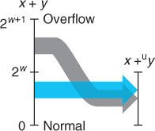

Relation between integer addition and unsigned addition: When x +y is greater than 2w – 1, the sum overflows

With a 4-bit word size, addition is performed modulo 16:

Since two's-complement addition has the exact same bit-level representation as unsigned addition, we can characterize the operation +wt as one of converting its arguments to unsigned, performing unsigned addition, and then converting back to two's complement:

When x + y is less than –2^(w–1), there is a negative overflow. When it is greater than or equal to 2^(w–1), there is a positive overflow

With a 4-bit word size, addition can have a negative overflow when x + y < –8 and a positive overflow when x + y ≥ 8

