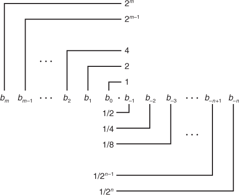
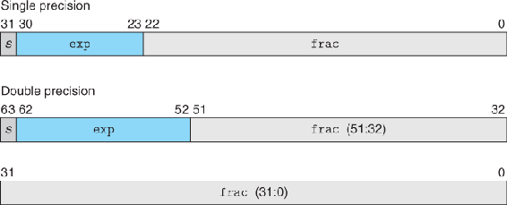
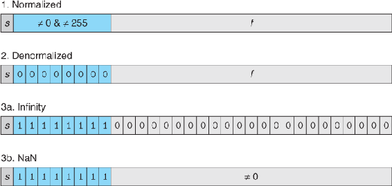
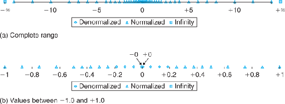

Fractional binary representation:

Standard floating-point formats

 - The single sign bit s directly encodes the sign s.
 - The k-bit exponent field exp = ek–1 · · · e1e0 encodes the exponent E.
 - The n-bit fraction field frac = fn–1 · · · f1f0 encodes the significand M, but the value encoded also depends on whether or not the exponent field equals 0.

The value of the exponent determines whether the number is (1) normalized, (2) denormalized, or (3) a special value:

Representable values for 6-bit floating-point format:

 - From int to float, the number cannot overflow, but it may be rounded.
 - From int or float to double, the exact numeric value can be preserved because double has both greater range (i.e., the range of representable values), as well as greater precision (i.e., the number of significant bits).
 - From double to float, the value can overflow to +∞ or –∞, since the range is smaller. Otherwise, it may be rounded, because the precision is smaller.
 - From float or double to int, the value will be rounded toward zero. For example, 1.999 will be converted to 1, while –1.999 will be converted to –1. Furthermore, the value may overflow. The C standards do not specify a fixed result for this case. Intel-compatible microprocessors designate the bit pattern [10 ... 00] (TMinw for word size w) as an integer indefinite value. Any conversion from floating point to integer that cannot assign a reasonable integer approximation yields this value. Thus, the expression (int) +1e10 yields –21483648, generating a negative value from a positive one.

