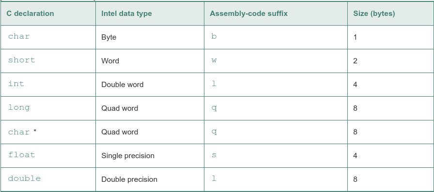

Sizes of C data types in x86-64:

most assembly-code instructions generated by gcc have a single-character suffix denoting the size of the operand. For example, the data movement instruction has four variants: movb (move byte), movw (move word), movl (move double word), and movq (move quad word). The suffix `l' is used for double words, since 32-bit quantities are considered to be 'long words.' The assembly code uses the suffix `l' to denote a 4-byte integer as well as an 8-byte double-precision floating-point number

