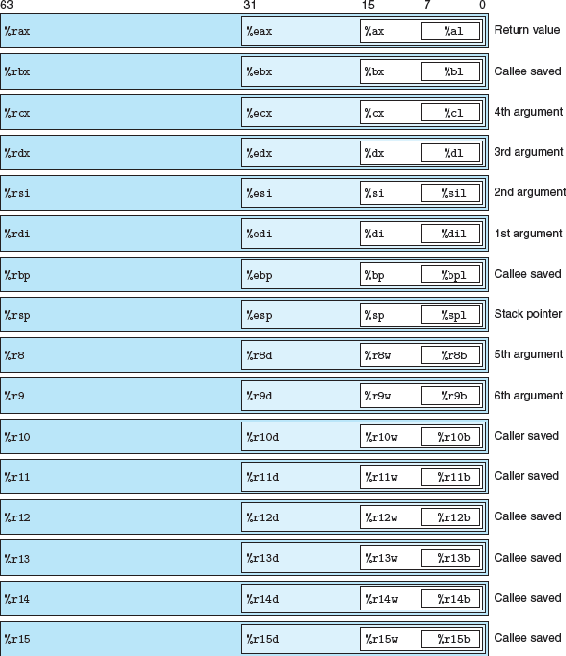
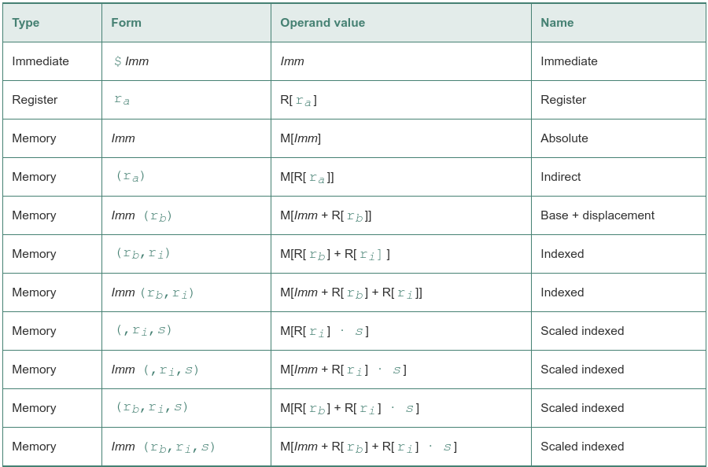
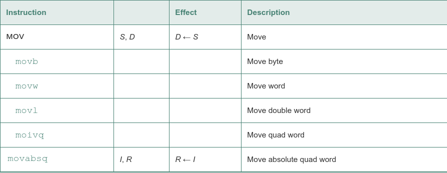
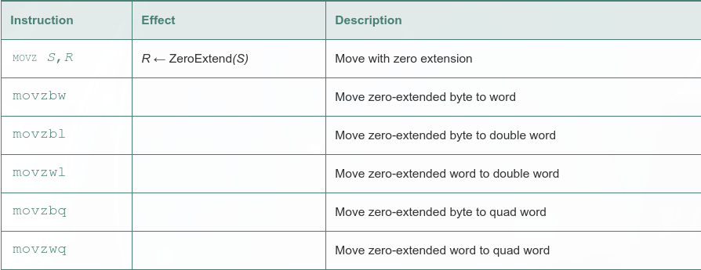
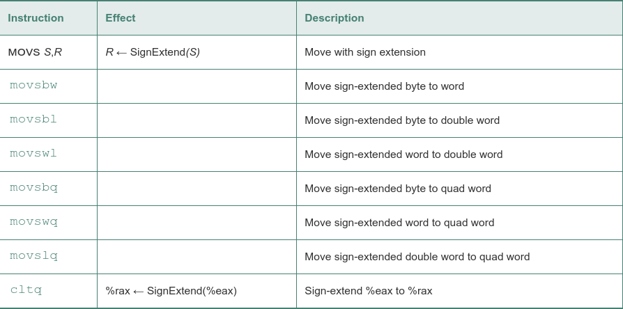
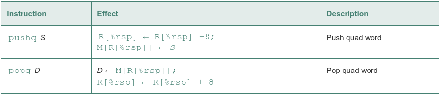
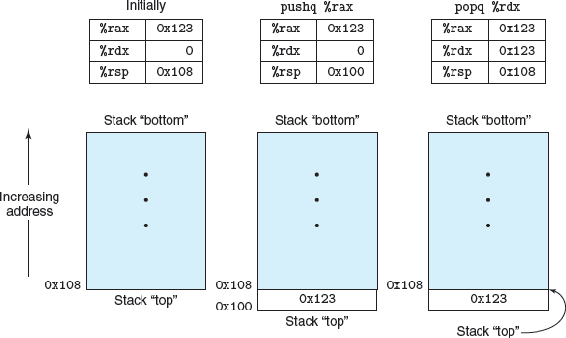

An x86-64 central processing unit (CPU) contains a set of 16 general-purpose registers storing 64-bit values

stack pointer, %rsp, used to indicate the end position in the run-time stack

Integer registers:

Operand forms:

 - immediate, is for constant values. In ATT-format assembly code, these are written with a `$' followed by an integer using standard C notation—for example, $-577 or $0x1F
 - register, denotes the contents of a register, one of the sixteen 8-, 4-, 2-, or 1-byte low-order portions of the registers for operands having 64, 32, 16, or 8 bits, respectively
 - memory reference, in which we access some memory location according to a computed address, often called the effective address

 Simple data movement instructions:

 

 source operand designates a value that is immediate, stored in a register, or stored in memory. The destination operand designates a location that is either a register or a memory address

     1  movl $0x4050,%eax   Immediate--Register, 4 bytes
     2  movw %bp,%sp        Register--Register, 2 bytes
     3  movb (%rdi,%rcx),%al    Memory--Register, 1 byte
     4  movb $-17,( %esp)   Immediate--Memory, 1 byte
     5  movq %rax,–12(%rbp) Register--Memory, 8 bytes

These instructions have a register or memory location as the source and a register as the destination.

The movs instructions have a register or memory location as the source and a register as the destination. The cltq instruction is specific to registers %eax and %rax:

Push and pop instructions:

By convention, we draw stacks upside down, so that the 'top' of the stack is shown at the bottom. With x86-64, stacks grow toward lower addresses, so pushing involves decrementing the stack pointer (register %rsp) and storing to memory, while popping involves reading from memory and incrementing the stack pointer:

stack pointer %rsp holds the address of the top stack element

the behavior of the instruction pushq %rbp is equivalent to that of the pair of instructions

    subq $8,%rsp        Decrement stack pointer
    movq %rbp,( %rsp)   Store %rbp on stack

instruction popq %rax is equivalent to the following pair of instructions:

    movq (%rsp),%rax    Read %rax from stack
    addq $8,%rsp        Increment stack pointer

