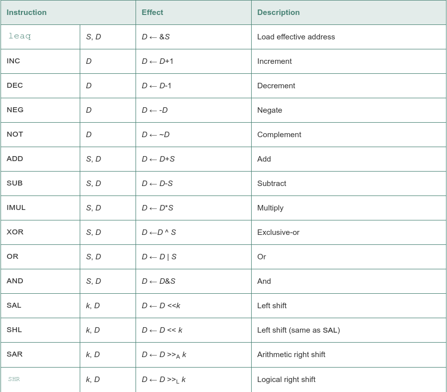
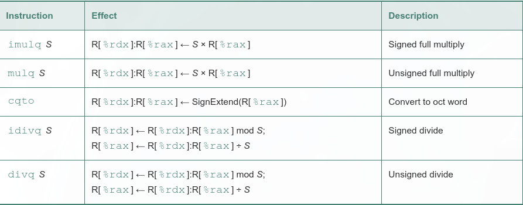

load effective address instruction leaq is actually a variant of the movq instruction. It has the form of an instruction that reads from memory to a register

Integer arithmetic operations:

As an illustration of the use of leaq in compiled code, consider the following C program:

	long scale(long x, long y, long z) {
	    long t = x + 4 * y + 12 * z;
	    return t;
	}

When compiled, the arithmetic operations of the function are implemented by a sequence of three leaq functions, as is documented by the comments on the right-hand side:

	  long scale(long x, long y, long z)
	  x in %rdi, y in %rsi, z in %rdx
	scale:
	  leaq	(%rdi,%rsi,4), %rax		x + 4*y
	  leaq	(%rdx,%rdx,2), %rdx		z + 2*z = 3*z
	  leaq	(%rax,%rdx,4), %rax		(x+4*y) + 4*(3*z) = x + 4*y + 12*z
	  ret

These operations provide full 128-bit multiplication and division, for both signed and unsigned numbers. The pair of registers %rdx and %rax are viewed as forming a single 128-bit oct word:

