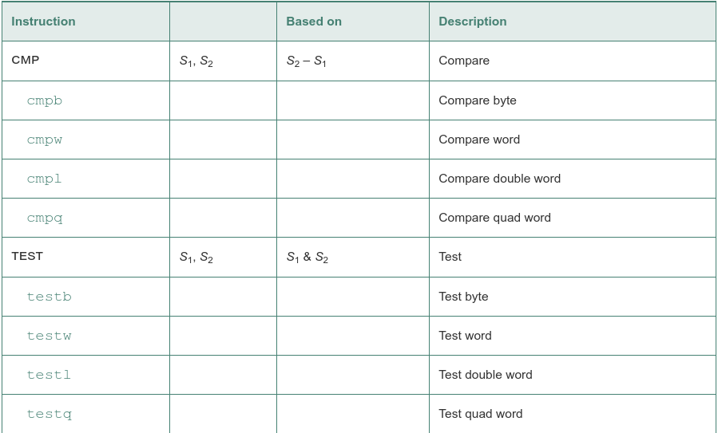
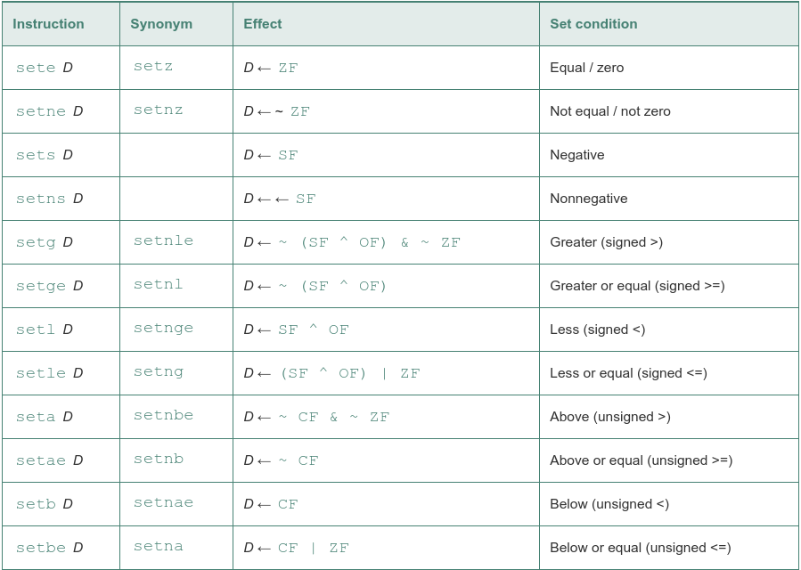
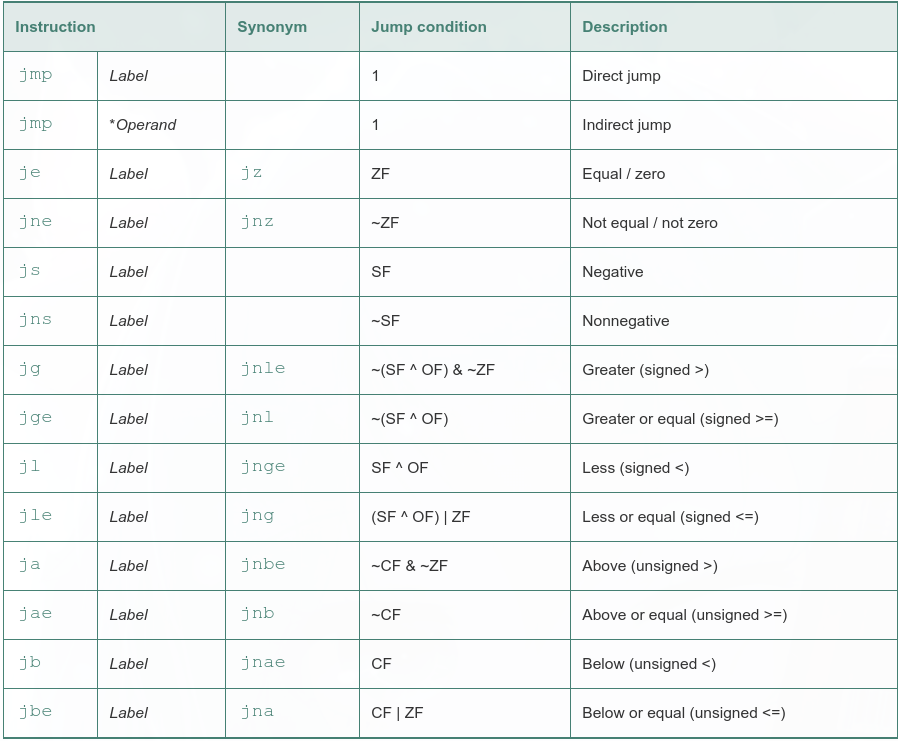
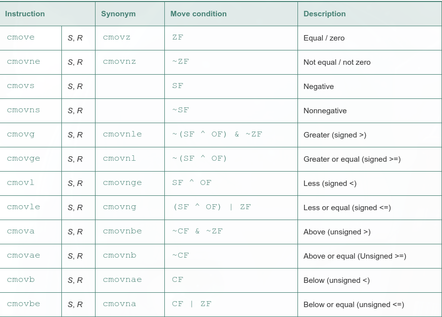

These condition codes are the most useful:

 - cf: Carry flag. The most recent operation generated a carry out of the most significant bit. Used to detect overflow for unsigned operations.
 - zf: Zero flag. The most recent operation yielded zero.
 - sf: Sign flag. The most recent operation yielded a negative value.
 - of: Overflow flag. The most recent operation caused a two's-complement overflow—either negative or positive.

 Comparison and test instructions, these instructions set the condition codes without updating any other registers:

 

Each instruction sets a single byte to 0 or 1 based on some combination of the condition codes. Some instructions have 'synonyms,' that is, alternate names for the same machine instruction:

    int comp(data_t a, data_t b)
      a in %rdi, b in %rsi
      1   comp:
      2    cmpq   %rsi, %rdi  Compare a:b
      3    setl   %al     Set low-order byte of %eax to 0 or 1
      4    movzbl %al, %eax   Clear rest of %eax (and rest of %rax)
      5    ret

jump instructions:

conditional move instructions:

conditional data transfers offer an alternative strategy to conditional control transfers for implementing conditional operations
