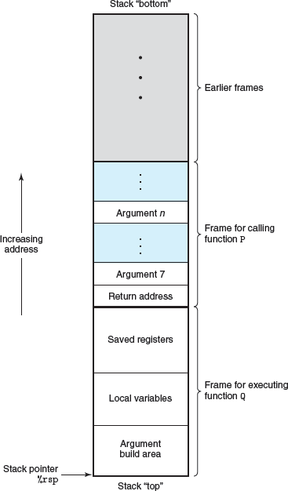
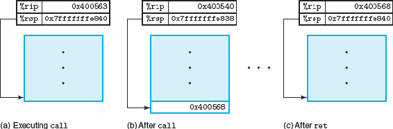
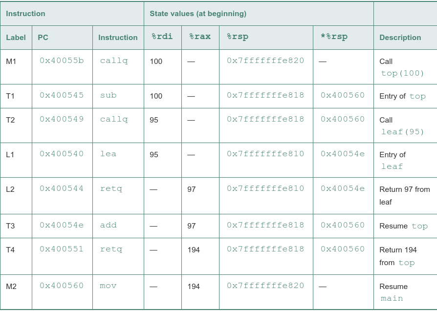
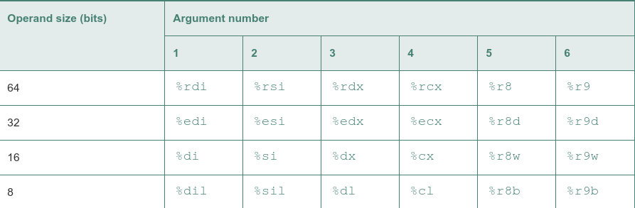

General stack frame structure:

The general forms of the call and ret instructions are described as follows:

    Instruction Description

    call Label  Procedure call
    call *Operand   Procedure call
    ret          Return from call

The call instruction transfers control to the start of a function, while the ret instruction returns back to the instruction following the call:

Detailed execution of program involving procedure calls and returns:

Registers for passing function arguments:

By convention, registers %rbx, %rbp, and %r12–%r15 are classified as callee-saved registers. When procedure P calls procedure Q, Q must preserve the values of these registers, ensuring that they have the same values when Q returns to P as they did when Q was called

All other registers, except for the stack pointer %rsp, are classified as caller-saved registers. This means that they can be modified by any function

Code for recursive factorial program:

        long rfact(long n)
        n in %rdi
    1   rfact:
    2   pushq   %rbx        Save %rbx
    3   movq    %rdi, %rbx  Store n in callee-saved register
    4   movl    $1, %eax    Set return value = 1
    5   cmpq    $1, %rdi    Compare n:1
    6   jle .L35        If <=, goto done
    7   leaq    -1(%rdi), %rdi Compute n-1
    8   call    rfact       Call rfact(n-1)
    9   imulq   %rbx, %rax  Multiply result by n
    10  .L35:          done:
    11  popq    %rbx        Restore %rbx
    12  ret         Return

calling a function recursively proceeds just like any other function call. Our stack discipline provides a mechanism where each invocation of a function has its own private storage for state information
