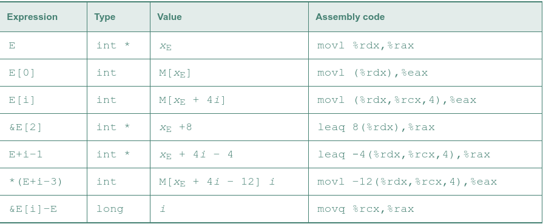
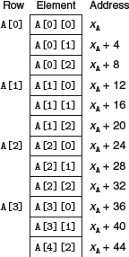

suppose the starting address of integer array E and integer index i are stored in registers %rdx and %rcx:

In general, for an array declared as T D[R][C]; array element D[i][j] is at memory address &D[ i ][ j ]=xD+L(C⋅i+j)

Elements of array in row-major order:

