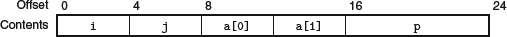

consider the following structure declaration:

	struct rec {
		int i;
		int j;
		int a[2];
		int *p;
	};

This structure contains four fields: two 4-byte values of type int, a two-element array of type int, and an 8-byte integer pointer, giving a total of 24 bytes

