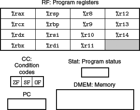

pi is equivalent to:  $\pi \approx 3.14159$
$$\mathbb{N} = \{ a \in \mathbb{Z} : a > 0 \}$$
$$\pi \approx 3.14159$$

1.1 Definition complex numbers
- A complex number is an ordered pair $(a, b)$, where $a, b \in \mathbf{R}$, but we will write this as $a+b i$.
- The set of all complex numbers is denoted by $\mathbf{C}$ :

$$\mathbf{C}=\{a+b i: a, b \in \mathbf{R}\}$$

- Addition and multiplication on $\mathbf{C}$ are defined by

$$(a+b i)+(c+d i)=(a+c)+(b+d) i,$$
$$(a+b i)(c+d i)=(a c-b d)+(a d+b c) i$$
here $a, b, c, d \in \mathbf{R}$.

elements of $\mathbf{F}$ are called __scalars__

Lists differ from sets in two ways: in lists, order matters and repetitions have meaning; in sets, order and repetitions are irrelevant

1.10 Definition $\mathbf{F}^n$
$\mathbf{F}^n$ is the set of all lists of length $n$ of elements of $\mathbf{F}$ :

$$\mathbf{F}^n=\left{\left(x_1, \ldots, x_n\right): x_j \in \mathbf{F} \text { for } j=1, \ldots, n\right}$$

$$\mathbf{F}^n=\left\\lbrace\left(x_1, \ldots, x_n\right): x_j \in \mathbf{F} \text { for } j=1, \ldots, n\right\\rbrace$$

For $\left(x_1, \ldots, x_n\right) \in \mathbf{F}^n$ and $j \in\{1, \ldots, n\}$, we say that $x_j$ is the $j^{\text {th }}$ coordinate of $\left(x_1, \ldots, x_n\right)$.

1.12 Definition addition in $\mathrm{F}^n$
Addition in $\mathbf{F}^n$ is defined by adding corresponding coordinates:

$$\left(x_1, \ldots, x_n\right)+\left(y_1, \ldots, y_n\right)=\left(x_1+y_1, \ldots, x_n+y_n\right)$$

