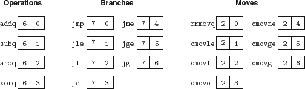

programmer-visible state, where the 'programmer' in this case is either someone writing programs in assembly code or a compiler generating machine-level code

Register %rsp is used as a stack pointer by the push, pop, call, and return instructions

ZF, SF, and OF, storing information about the effect of the most recent arithmetic or logical instruction

program counter (PC) holds the address of the instruction currently being executed

Function codes for Y86-64 instruction set

