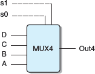
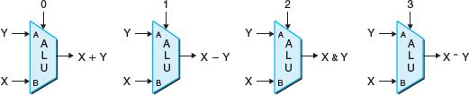
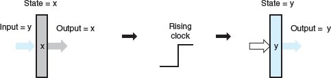
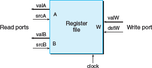

Three major components are required to implement a digital system: combinational logic to compute functions on the bits, memory elements to store bits, and clock signals to regulate the updating of the memory elements

logic gate types

Combinational circuit to test for bit equality: output will equal 1 when both inputs are 0 or both are 1

    bool eq = (a && b) || (!a && !b);

Single-bit multiplexor circuit: output will equal input a if the control signal s is 1 and will equal input b when s is 0

    bool out = (s && a) || (!s && b);

Word-level equality test circuit: output will equal 1 when each bit from word A equals its counterpart from word B

Word-level multiplexor circuit: output will equal input word A when the control signal s is 1, and it will equal B otherwise. Multiplexors are described in HCL using case expressions

	word Out = [
		s: A;
		1: B;
	];

A case expression has the following general form:

	[
	select1 : expr1;
	select2 : sxpr2;
	⋮
	selectk : exprk;
	]
	
Four-way multiplexor

	word Out4 = [
		!s1 && !s0 : A; # 00
		!s1 : B; # 01
		!s0 : C; # 10
		1 : D; # 11
	];

Arithmetic/logic unit (ALU): Depending on the setting of the function input, the circuit will perform one of four different arithmetic and logical operations

Combinational circuits, by their very nature, do not store any information. Instead, they simply react to the signals at their inputs, generating outputs equal to some function of the inputs. To create sequential circuits—that is, systems that have state and perform computations on that state—we must introduce devices that store information represented as bits. Our storage devices are all controlled by a single clock, a periodic signal that determines when new values are to be loaded into the devices

Clocked registers (or simply registers) store individual bits or words, Random access memories (or simply memories) store multiple words, using an address to select which word should be read or written

Register operation:

typical register file:

