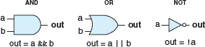
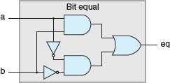
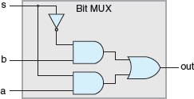
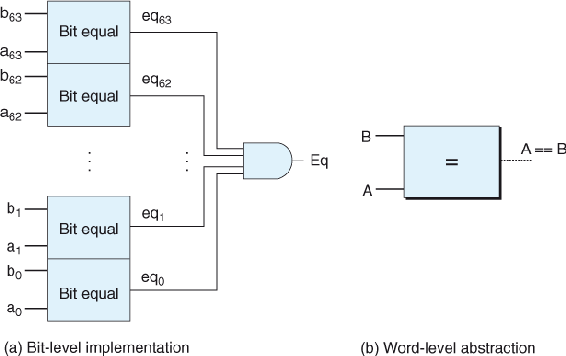

Three major components are required to implement a digital system: combinational logic to compute functions on the bits, memory elements to store bits, and clock signals to regulate the updating of the memory elements

logic gate types

Combinational circuit to test for bit equality: output will equal 1 when both inputs are 0 or both are 1

    bool eq = (a && b) || (!a && !b);

Single-bit multiplexor circuit: output will equal input a if the control signal s is 1 and will equal input b when s is 0

    bool out = (s && a) || (!s && b);

Word-level equality test circuit: output will equal 1 when each bit from word A equals its counterpart from word B

