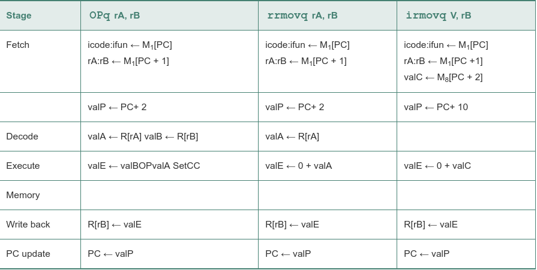

informal description of the stages and the operations performed within them:

 - Fetch. The fetch stage reads the bytes of an instruction from memory, using the program counter (PC) as the memory address. From the instruction it extracts the two 4-bit portions of the instruction specifier byte, referred to as icode (the instruction code) and ifun (the instruction function). It possibly fetches a register specifier byte, giving one or both of the register operand specifiers rA and rB. It also possibly fetches an 8-byte constant word valC. It computes valP to be the address of the instruction following the current one in sequential order. That is, valP equals the value of the PC plus the length of the fetched instruction.

 - Decode. The decode stage reads up to two operands from the register file, giving values valA and/or valB. Typically, it reads the registers designated by instruction fields rA and rB, but for some instructions it reads register %rsp.

 - Execute. In the execute stage, the arithmetic/logic unit (ALU) either performs the operation specified by the instruction (according to the value of ifun), computes the effective address of a memory reference, or increments or decrements the stack pointer. We refer to the resulting value as valE. The condition codes are possibly set. For a conditional move instruction, the stage will evaluate the condition codes and move condition (given by ifun) and enable the updating of the destination register only if the condition holds. Similarly, for a jump instruction, it determines whether or not the branch should be taken.

 - Memory. The memory stage may write data to memory, or it may read data from memory. We refer to the value read as valM.

 - Write back. The write-back stage writes up to two results to the register file.

 - PC update. The PC is set to the address of the next instruction.

The processor loops indefinitely, performing these stages

These instructions compute a value and store the result in a register. The notation icode: ifun indicates the two components of the instruction byte, while rA : rB indicates the two components of the register specifier byte. The notation M1[x] indicates accessing (either reading or writing) 1 byte at memory location x, while M8[x] indicates accessing 8 bytes:

