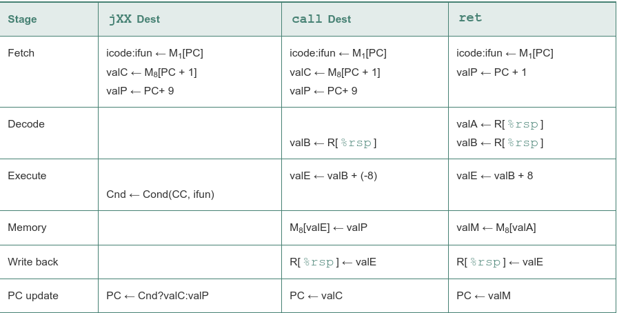

informal description of the stages and the operations performed within them:

 - Fetch. The fetch stage reads the bytes of an instruction from memory, using the program counter (PC) as the memory address. From the instruction it extracts the two 4-bit portions of the instruction specifier byte, referred to as icode (the instruction code) and ifun (the instruction function). It possibly fetches a register specifier byte, giving one or both of the register operand specifiers rA and rB. It also possibly fetches an 8-byte constant word valC. It computes valP to be the address of the instruction following the current one in sequential order. That is, valP equals the value of the PC plus the length of the fetched instruction.

 - Decode. The decode stage reads up to two operands from the register file, giving values valA and/or valB. Typically, it reads the registers designated by instruction fields rA and rB, but for some instructions it reads register %rsp.

 - Execute. In the execute stage, the arithmetic/logic unit (ALU) either performs the operation specified by the instruction (according to the value of ifun), computes the effective address of a memory reference, or increments or decrements the stack pointer. We refer to the resulting value as valE. The condition codes are possibly set. For a conditional move instruction, the stage will evaluate the condition codes and move condition (given by ifun) and enable the updating of the destination register only if the condition holds. Similarly, for a jump instruction, it determines whether or not the branch should be taken.

 - Memory. The memory stage may write data to memory, or it may read data from memory. We refer to the value read as valM.

 - Write back. The write-back stage writes up to two results to the register file.

 - PC update. The PC is set to the address of the next instruction.

The processor loops indefinitely, performing these stages

OPq, rrmovq, and irmovq. These instructions compute a value and store the result in a register. The notation icode: ifun indicates the two components of the instruction byte, while rA : rB indicates the two components of the register specifier byte. The notation M1[x] indicates accessing (either reading or writing) 1 byte at memory location x, while M8[x] indicates accessing 8 bytes:

rmmovq and mrmovq. These instructions read or write memory:

pushq and popq:

jXX, call, and ret. These instructions cause control transfers:

SEQ, a sequential implementation:

 - Clocked registers are shown as white rectangles. The program counter PC is the only clocked register in SEQ.
  
 - Hardware units are shown as light blue boxes. These include the memories, the ALU, and so forth. We will use the same basic set of units for all of our processor implementations. We will treat these units as 'black boxes' and not go into their detailed designs.
  
 - Control logic blocks are drawn as gray rounded rectangles. These blocks serve to select from among a set of signal sources or to compute some Boolean function. We will examine these blocks in complete detail, including developing HCL descriptions.
  
 - Wire names are indicated in white circles. These are simply labels on the wires, not any kind of hardware element.
  
 - Word-wide data connections are shown as medium lines. Each of these lines actually represents a bundle of 64 wires, connected in parallel, for transferring a word from one part of the hardware to another.
  
 - Byte and narrower data connections are shown as thin lines. Each of these lines actually represents a bundle of four or eight wires, depending on what type of values must be carried on the wires.
  
 - Single-bit connections are shown as dotted lines. These represent control values passed between the units and blocks on the chip.

Hardware structure of SEQ:

Tracing two cycles of execution by SEQ:

Constant values used in HCL descriptions:

Name    Value (hex) Meaning
IHALT   0   Code for halt instruction
INOP    1   Code for nop instruction
IRRMOVQ 2   Code for rrmovq instruction
IIRMOVQ 3   Code for irmovq instruction
IRMMOVQ 4   Code for rmmovq instruction
IMRMOVQ 5   Code for mrmovq instruction
IOPL    6   Code for integer operation instructions
IJXX    7   Code for jump instructions
ICALL   8   Code for call instruction
IRET    9   Code for ret instruction
IPUSHq  A   Code for pushq instruction
ipopq   B   Code for popq instruction
FNONE   0   Default function code
RESP    4   Register ID for %rsp
RNONE   F   Indicates no register file access
ALUADD  0   Function for addition operation
SAOK    1   Status code for normal operation
SADR    2   Status code for address exception
SINS    3   Status code for illegal instruction exception
SHLT    4   Status code for halt

